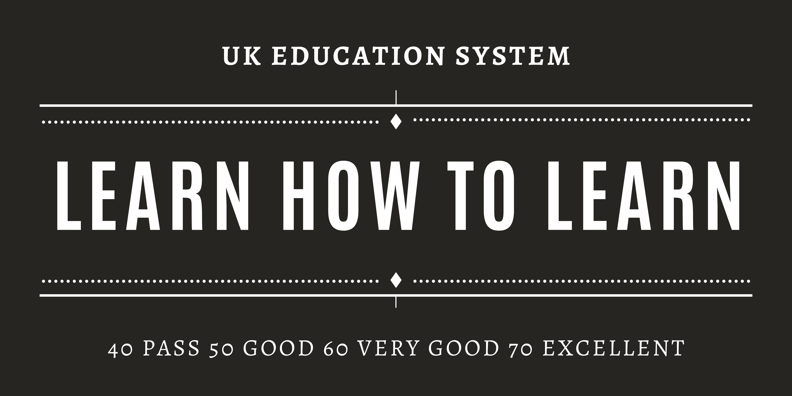

# Hello 👋 I'm Cynthia

I'm currently a student from the 2020 October cohort at the **University of London BSc Computer Science** degree. Trying to map our my life in tech, working towards independency. 

> Feel free to take a look at my notes for [DM](https://ccy05327.github.io/DM/), [CM](https://ccy05327.github.io/CM/), [FCS](https://ccy05327.github.io/FCS/), and [SDD](https://ccy05327.github.io/SDD/)

> Check [here](https://mydegree.notion.site/) to see my progress for studying

> Check [here](https://ccy05327.notion.site/) for life related projects

## Before 2023...

### Goal

- Publish an Android App on Google Play Store ([SDV](https://github.com/ccy05327/Sleep-Data-Visualization))
- Not afraid of Algorihtms
- GDSC UoL Lead(?) 2022-2023

### Working Towards

- Leading tech-related projects
- Knowing the whole process of web/app development cycle
- Make an impact on [my](https://uol-taiwan.github.io/) & [uol](https://world-class.github.io/) community online

## FAQs

### What's your reason of choosing the degree?

- There are a few, but the top one is:

    

    I value having flexibility in life that allows me to say yes to opportunities while keeping my physical & mental health in tack. 

### What do you like the most about the degree?

- Same answer above, plus this:

    

    I'm not British, so the whole system is new to me when I enter, but I soon developed a love for it. The whole "you only need 40 to pass, you learn everything provided to get 70, you do extra to get 70+" thing amazed me. 

## Links

- [UoL CS Coursera](https://www.coursera.org/degrees/bachelor-of-science-computer-science-london)
- [UoL Student Discord](https://discord.gg/tnPrm5vfAs)
    - I'm fairly active on it, so if you want to connect with me, feel free to go there
- [UoL CS Reddit](https://www.reddit.com/r/UniversityOfLondonCS/)
- [REPL FAQ](https://world-class.github.io/REPL/faq/)